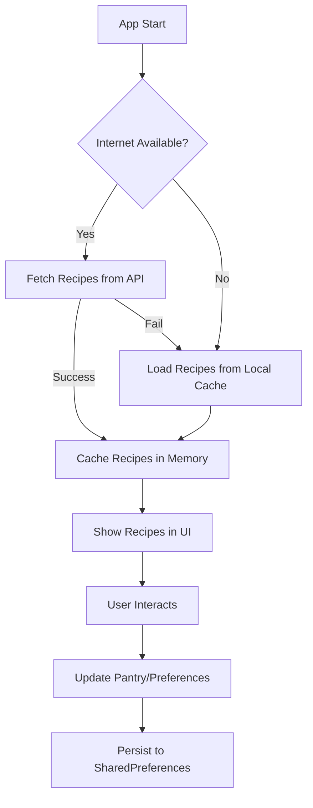
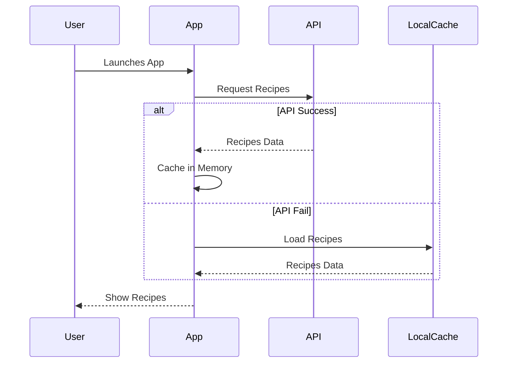

# Cauldron: Smart Recipe App — Caching Algorithms Deep Dive

**This project was developed as part of the BuildIT competition, an internal mini-hackathon organized by the IT section of Micro Club.**

**Team:** Build_X  
**Mentor:** Amine Heddouche
---

## Future Fixes and Enhancements

- Add more robust error handling and user feedback for network/API failures
- Implement advanced caching strategies (e.g., LRU/LFU) for larger datasets
- Add user authentication and cloud sync for recipes and preferences
- Improve accessibility and localization support
- Enhance UI/UX with more animations and onboarding
- Add support for push notifications and scheduled reminders
- Integrate more external recipe APIs and allow user-submitted recipes
- Optimize for performance and battery usage


## Concept Deep Dive: Caching Algorithms

Caching algorithms are fundamental to computer science and software engineering, enabling systems to store frequently or recently accessed data for faster retrieval. In the context of mobile apps, caching is critical for:
- Reducing network latency and bandwidth usage
- Improving perceived performance and responsiveness
- Enabling offline functionality
- Minimizing redundant computations and API calls

**Key Caching Strategies:**
- **LRU (Least Recently Used):** Maintains a list of items ordered by last access; when the cache is full, the least recently accessed item is evicted. This is ideal for scenarios where recent data is more likely to be reused.
- **LFU (Least Frequently Used):** Tracks how often each item is accessed; the least frequently accessed item is evicted first. Useful when some data is accessed much more than others.
- **Write-Through/Write-Back:** Determines when changes to cached data are persisted to permanent storage. Write-through writes immediately, while write-back defers until eviction or sync.
- **Cache Invalidation:** Ensures that stale or outdated data is removed or refreshed, which is crucial for correctness in dynamic systems.

**Mobile App Caching Considerations:**
- **Memory Constraints:** Mobile devices have limited RAM, so cache size and eviction policy are important.
- **Persistence:** Some data (like user settings) should survive app restarts, requiring persistent storage (e.g., SharedPreferences, SQLite, files).
- **Consistency:** Cached data must be kept in sync with remote sources or invalidated when necessary.

In Cauldron, these principles are applied to balance speed, freshness, and reliability for recipes, user preferences, and assets.

---


## How the System Works Internally

### Recipe Fetching and Caching
- **Startup:**
	- The app first attempts to fetch the latest recipes from the remote API (TheMealDB).
	- If the API is unreachable or returns no data, the app loads recipes from a bundled local JSON file (`assets/data/recipes.json`).
	- All loaded recipes are stored in memory for the duration of the session, enabling fast access and filtering.
- **Session Caching:**
	- Recipes remain in memory, so navigation and filtering are instant.
	- No explicit LRU/LFU is used for recipes, as the dataset is small and fits comfortably in memory.
- **Offline Support:**
	- The local JSON asset ensures the app is usable even without internet access.

### User Preferences and Pantry
- **Persistent Caching:**
	- User allergies, preferences, and pantry contents are stored using `SharedPreferences`, a key-value persistent store.
	- This data is loaded at app startup and updated immediately upon user changes (write-through strategy).
- **Consistency:**
	- The app ensures that user data is always up-to-date and available across sessions.

### Image & Asset Caching
- **Image Caching:**
	- Images loaded from the network are cached by Flutter’s image provider, reducing redundant downloads.
	- Asset images are bundled with the app and loaded instantly from disk.

### Error Handling and Fallbacks
- If both the API and local cache fail, the app displays an error message to the user, ensuring transparency and debuggability.

---

## Architecture Diagram



---


## Design Decisions & Trade-offs

- **API-First, Asset Fallback:**
	- Prioritizes fresh data for users with internet, but guarantees a working experience offline.
	- Trade-off: May show slightly outdated recipes offline, but never leaves the user with an empty app.
- **In-Memory Caching for Recipes:**
	- Chosen for speed and simplicity, as the recipe dataset is small and filtering is frequent.
	- Trade-off: Recipes are reloaded on each app launch, but this is fast and ensures freshness.
- **Persistent Caching for User Data:**
	- User preferences and pantry are critical for personalization, so they are always persisted.
	- Trade-off: SharedPreferences is not suitable for large or complex data, but is perfect for small user settings.
- **No LRU/LFU for Recipes:**
	- The app does not implement LRU/LFU for recipes because the working set is small and all recipes are equally important.
- **Cache Invalidation:**
	- Recipes are refreshed on every app launch (by design), ensuring users always see the latest data when online.
	- User data is updated immediately on change, so there is no risk of stale preferences.

---


## How This Implementation Applies Caching Algorithms

- **Startup:**
	- Implements a hybrid cache: tries to fetch from the API (network cache), and if that fails, uses a local asset (disk cache).
	- This is similar to a two-level cache in computer architecture.
- **Session:**
	- All recipes and user data are held in memory for the session, providing O(1) access for filtering and display.
- **Persistence:**
	- User settings and pantry use a write-through cache: every change is immediately written to disk, ensuring no data loss.
- **Offline Support:**
	- The local asset cache is always available, so the app never fails due to network issues.
- **Cache Invalidation:**
	- Recipes are invalidated and refreshed on every app launch; user data is updated on every change.

---


## Implementation Details

- **Recipe Caching:**
	- `PotionRepository` is responsible for fetching recipes. It first calls the API via `MealDBApi.fetchAllRecipes()`. If the API returns an empty list or throws an error, it loads recipes from the local JSON asset using `RecipesDataSource.loadRecipes()`.
	- All recipes are stored in a provider (`PotionProvider`) for in-memory access and filtering.
- **User Data:**
	- Allergies, preferences, and pantry are managed by their respective providers and persisted using `SharedPreferences`.
	- Data is loaded at startup and written through on every change.
- **Image Caching:**
	- Network images are cached by Flutter’s image provider, reducing bandwidth and improving load times.
	- Asset images are bundled and loaded instantly.
- **Error Handling:**
	- If both API and local cache fail, the app sets an error state, which is displayed in the UI to inform the user.
	- All exceptions are caught and logged for debugging.

---

## Setup Instructions

1. **Clone the repository:**
	 ```sh
	 git clone <repo-url>
	 cd cauldron
	 ```
2. **Install dependencies:**
	 ```sh
	 flutter pub get
	 ```
3. **Run the app:**
	 ```sh
	 flutter run
	 ```
4. **Build release APK:**
	 ```sh
	 flutter build apk --release
	 ```
5. **Assets:**
	 - Ensure `assets/data/recipes.json` and all images are present and listed in `pubspec.yaml`.

---

## Example: Caching Flow



---

## References
- [Flutter Caching Best Practices](https://docs.flutter.dev/perf/rendering/caching)
- [TheMealDB API](https://www.themealdb.com/api.php)
- [SharedPreferences](https://pub.dev/packages/shared_preferences)
